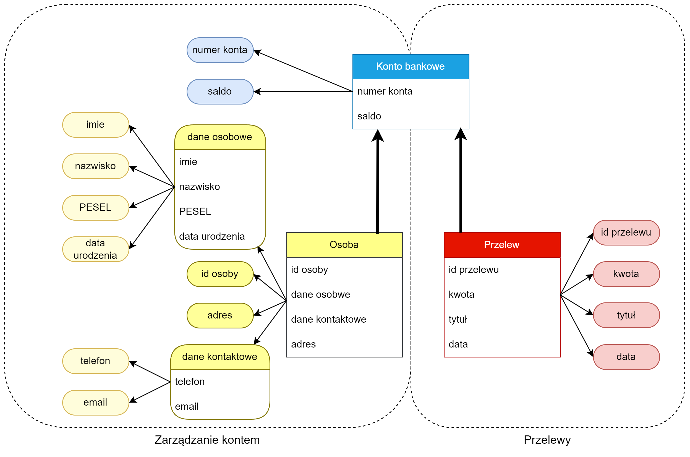

# Zadanie 1 - Domain Driven Design

## Opis rozwiązania

Poniżej znajduje się fragment projektu aplikacji bankowej wykonany z wykorzystaniem zasad Domain Driven Design. Wyodrębnione zostały dwa konteksty: `Zarządzanie kontem` oraz `Przelewy`. Wewnątrz kontekstów zostały zdefiniowane trzy encje: `Osoba`, `Przelew`, `Konto bankowe`, z czego ta ostatnia encja istnieje w obydwu kontekstach. Encje mają swoje atrybuty wyrażone obiektami wartości, które na poniższym diagramie reprezentowane są poprzez zaokrąglone prostokąty. Kolory na diagramie mają na celu jedynie ułatwić połączenie obiektów z ich rodzicem. 

## Diagram

## Specyfikacja obiektów

| obiekt | typ obiektu | specyfikacja danych |
| ------ | ----------- | ------------ |
| Osoba  | encja       | -            |
| Osoba / id osoby | obiekt wartości | unikalny ciąg cyfr {10} |
| Osoba / adres | obiekt wartości | ciąg znaków {1-500}|
| Osoba / dane kontaktowe | obiekt wartości | - |
| Osoba / dane kontaktowe / telefon | obiekt wartości | ciąg cyfr {1-25}|
| Osoba / dane kontaktowe / email | obiekt wartości | ciąg znaków {3-255} |
| Osoba / dane osobowe | obiekt wartości | |
| Osoba / dane osobowe / imie | obiekt wartości | ciąg znaków {1-100} |
| Osoba / dane osobowe / nazwisko | obiekt wartości | ciąg znaków {1-100} |
| Osoba / dane osobowe / PESEL | obiekt wartości | unikalny ciąg cyfr {11} |
| Osoba / dane osobowe / data urodzenia | obiekt wartości | date |
| Konto bankowe  | encja       | -            |
| Konto bankowe / numer konta | obiekt wartości | unikalny ciąg cyfr {26} |
| Konto bankowe / saldo | obiekt wartości | liczba zmiennoprzecinkowa z zakresu [1e-10; 1e+10] |
| Przelew  | encja       | -            |
| Przelew / id przelewu | obiekt wartości |  unikalny ciąg cyfr {30} |
| Przelew / kwota | obiekt wartości | liczba zmiennoprzecinkowa z zakresu [0; 1e+10] |
| Przelew / tytuł | obiekt wartości | ciąg znaków {1-100} |
| Przelew / data | obiekt wartości | timestamp |
