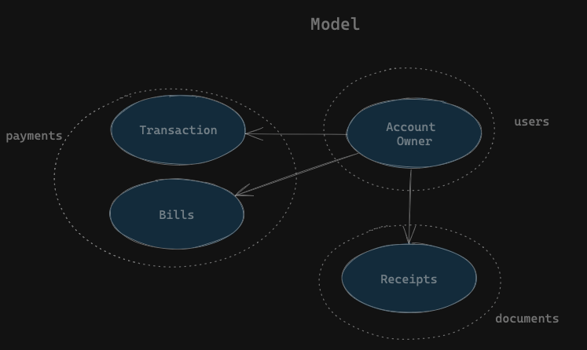
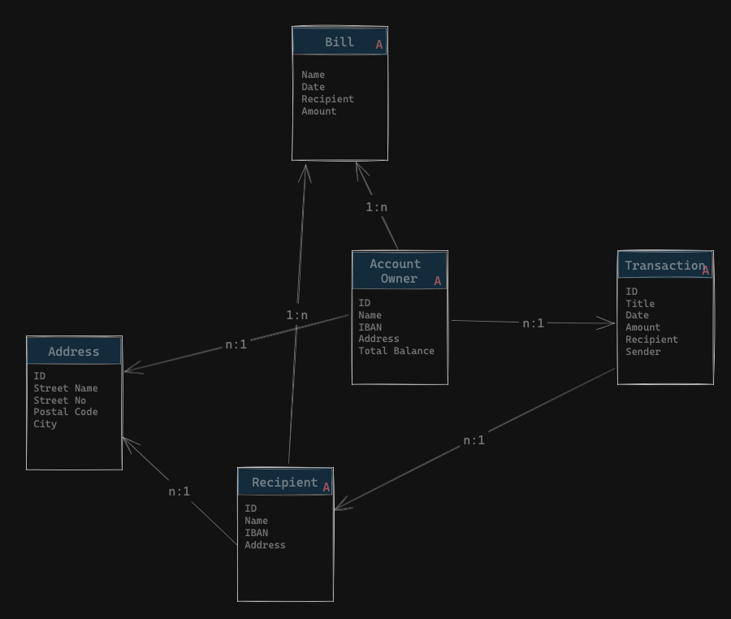
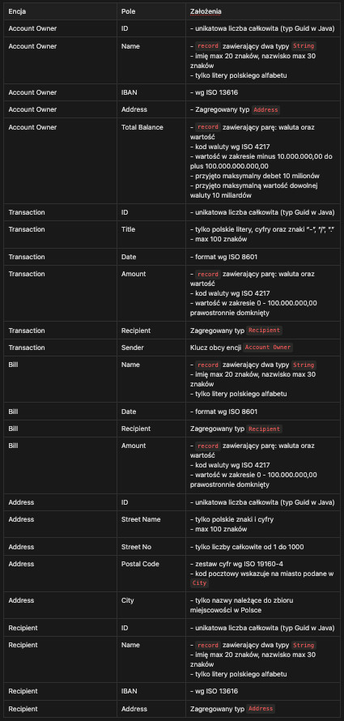

# Opis zadania
Celem zadania jest sformułowanie projektu aplikacji bankowej wg DDD. Funkcje aplikacji są następujące:

- wykonanie przelewu
- podgląd historii transakcji
- wygenerowanie potwierdzenia przelewu
- wygenerowanie wykresu wydatków per miesiąc
- płatność za rachunki

# Model
Na podstawie opisanych funkcji aplikacji, narysowano następujący model:

Na podstawie modelu wyrózniono następujące encje i zalezności pomiędzy nimi:

Encje mające przy nazwie czerwoną literę A są agregatami.

# Przyjęte założenia 

Wyróżniono dwa konteksty w ramach prezentowanego modelu dla encji Recipient:

- podczas płacenia rachunków (Bill) jest to adres urzędu/podmiotu
- podczas wykonywania zwykłej transakcji (Transaction) jest to adres osoby fizycznej

Dodatkowo wszystkie ciągi znaków są sanityzowane przez xssProtection() oraz Jsoup(). Żadne pole nie jest typem generycznym.

