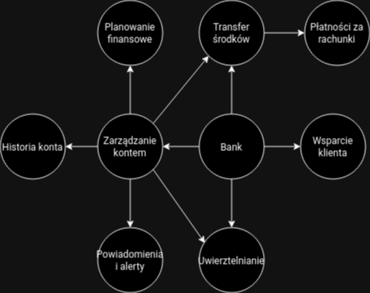
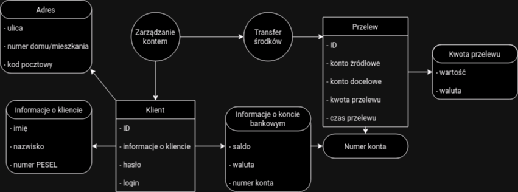

# Modelowanie Fragmentu Bezpiecznej Aplikacji Bankowej z Wykorzystaniem DDD

## Opis Zadania

W ramach zadania zostało wykonane modelowanie Domain Driven Design. W tym celu zamodelowane bezpieczną aplikację bankową.
W pierwszej kolejności skupiono się na ujęciu ogólnymi przedstawieniu ogólnych kontekstow aplikacji. Następnie w ramach
agregatu przedstawiono fragment związany z zarządzaniem kontem oraz przelewem i wynikające z tego ograniczenia jak i
przykładowe integracje między nimi.

## Obrazki Modelu

### Bounded context
W ramach kontekstu została przedstawiona aplikacja bankowa na którą składają się: zarządzanie kontem, uwierzytelnianie,
transfer środków, wsparcie klienta oraz powiązane z tym inne konteksty.

### Agregate
W ramach agregatu skupiono się na zarządzaniu kontem oraz transferze środków.

## Tabela założeń

| Encja/Obiekt Wartości | Atrybuty                | Formaty danych                                            |
|------------------------|-------------------------|-----------------------------------------------------------|
| Klient                 | - ID                    | UUID                                                      |
|                        | - Imię                  | String                                                    |
|                        | - Nazwisko              | String                                                    |
|                        | - Numer PESEL           | String (11 cyfr)                                          |
|                        | - Login                 | String                                                    |
|                        | - Hasło (zahashowane)   | String                                                    |
| Adres                  | - Ulica                 | String                                                    |
|                        | - Numer domu/mieszkania | String                                                    |
|                        | - Kod pocztowy          | String (format: XX-XXX)                                   |
| KontoBankowe           | - Numer konta           | String (unikalny format, np. XX-XXXX-XXXX-XXXX-XXXX-XXXX) |
|                        | - Saldo                 | String                                                    |
|                        | - Waluta                | Enum (np. PLN, USD, EUR)                                  |
| KwotaPrzelewu          | - Wartość               | String                                                    |
|                        | - Waluta                | Enum (np. PLN, USD, EUR)                                  |
| Przelew                | - ID                    | UUID                                                      |
|                        | - Konto źródłowe        | String (unikalny format, np. XX-XXXX-XXXX-XXXX-XXXX-XXXX) |
|                        | - Konto docelowe        | String (unikalny format, np. XX-XXXX-XXXX-XXXX-XXXX-XXXX) |
|                        | - KwotaPrzelewu         | String                                                    |
|                        | - Czas wykonania        | DateTime                                                  |

### Przykładowe integracje:

- Tworzenie nowego przelewu pomiędzy kontami bankowymi.
- Sprawdzanie historii przelewów dla danego konta.

