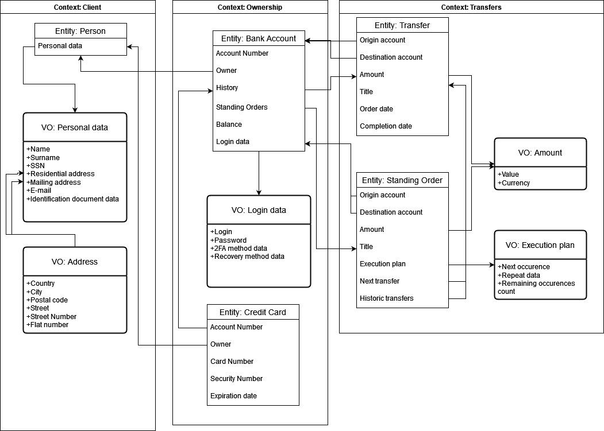

# DDD

Celem zadania jest zamodelowanie bezpiecznej aplikacji bankowej (fragmentu) wykorzystując zasady Domain Driven Design.

W zadaniu opisano fragment systemu odpowiedzialny za podstawowe transakcje bankowe - jednorazowy przelew oraz cykliczny przelew. Rozpisano 5 encji - osoby, konta bankowego, karty kredytowej oraz przelewu i cyklicznego przelewu.

Validations:

| Object        | Attribute       | Validation                                           |
|---------------|-----------------|------------------------------------------------------|
| Personal data | Name            | Alphabetical characters + [-'], length < 100         |
|               | Surname         | Alphabetical characters + [-']                       |
|               | SSN             | Country dependent                                    |
|               | E-mail          | Alphanumeric, single '@' character                   |
| Address       | Country         | Country ISO 3166-1 alpha-3 code                      |
|               | City            | Alphabetical characters + [-'], length < 100         |
|               | Postal Code     | Country dependent, alphanumeric + [-], length < 20   |
|               | Street          | Alphabetical characters + [-'], length < 100         |
|               | Street Number   | Alphabetical characters, length < 10                 |
|               | Flat Number     | Alphabetical characters, length < 10                 |
| Bank Account  | Account Number  | NRB (Numer Rachunku Bankowego) compliant - 26 digits |
| Login Data    | Login           | Alphanumeric, length < 100                           |
|               | Password        | Unicode characters, length < 100                     |
| Credit Card   | Card Number     | Numbers only, length == 16                           |
|               | Security Number | Numbers only, length == 3                            |
|               | Expiration Date | 'MM/YY' format                                       |
| Amount        | Value           | Numeric, 2 fractional digits                         |
|               | Currency        | Currency ISO 4217 code                               |