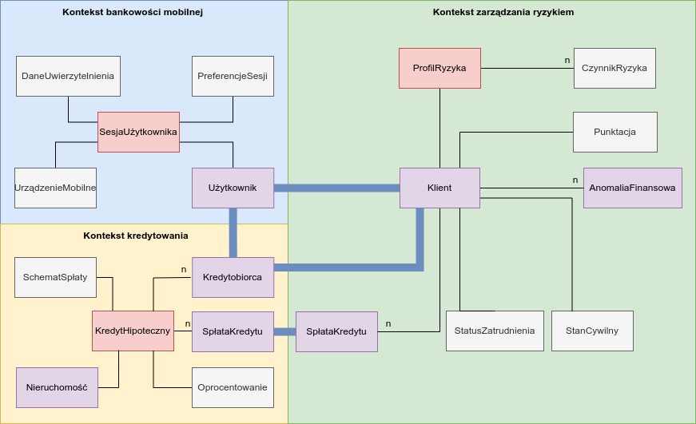

## Opis zadania

Zadanie polega na zdefiniowaniu modelu systemu bankowego: wyróżnieniu kontekstów, agregat, encji i obiektów wartości.
Na poniższym rysunku przedstawiono wysokopoziomowy model systemu z wyróżnionymi trzema kontekstami:

- kontekst bankowości mobilnej
- kontekst kredytowania
- kontekst zarządzania ryzykiem

## Opis modelu

Każdy kontekst posiada:

- agregaty (z rootami zaznaczonymi kolorem czerwonym)
- encje (zaznaczone kolorem fioletowym),
- obiekty wartości (zaznaczone kolorem szarym)

Połączenia między encjami zaznaczono kolorem czarnym. Litera `n` przy zakończeniu połączenia do encji oznacza relację "
do wielu". Brak literki oznacza relację "do jednego".

Kolorem niebieskim, w celu połączono encje, które konceptualnie reprezentują to samo, lecz ich rola i reprezentacja
zależy od kontekstu, w którym się znajdują.

## Przyjęte założenia

Poniższa tabela rozwija encję `Klient` z kontekstu zarządzania ryzykiem. w tabeli przedstawiono jej atrybuty i
ograniczenia.

| **Atrybut encji**      | **Typ atrybutu**                                                                                                                                                                                                                                                                                               | **Opis**                                                                                      | **Podatrybut**                      | **Ograniczenia podatrybutu**                           |
|------------------------|----------------------------------------------------------------------------------------------------------------------------------------------------------------------------------------------------------------------------------------------------------------------------------------------------------------|-----------------------------------------------------------------------------------------------|-------------------------------------|--------------------------------------------------------|
| **AnomaliaFinansowa**  | Encja – każda anomalia musi być śledzona                                                                                                                                                                                                                                                                       | Encja reprezentująca anomalię finansową, która ma wpływ na ocenę ryzyka związanego z klientem |                                     |                                                        |
|                        |                                                                                                                                                                                                                                                                                                                |                                                                                               | ID                                  | Ciąg znaków w formacie UUID4                           |
| ** **               |                                                                                                                                                                                                                                                                                                                |                                                                                               | typAnomalii                         | Jedna ze stałych, predefiniowanych wartości tesktowych |
|                        |                                                                                                                                                                                                                                                                                                                |                                                                                               | dataWykrycia                        | Ciąg znaków w formacie YYYY-MM-DD HH:MM:SS             |
| ** **               |                                                                                                                                                                                                                                                                                                                |                                                                                               |                                     |                                                        |
| **SpłataKredytu**      | Encja – każda spłata musi być śledzona. _**Tłumaczenie na kontekst pożyczek może polegać na odwołaniu do repozytorium transakcji po ID transakcji oraz pobraniu z niego danych ważnych w kontekście pożyczek, na przykład kwotę, czy konkretną datę w celu np. odniesienia transakcji do stawek oprocentowania**_ | Encja reprezentująca pojedynczą spłatę kredytu w kontekście oceny ryzyka                      |                                     |                                                        |
|                        |                                                                                                                                                                                                                                                                                                                |                                                                                               | ID                                  | Ciąg znaków w formacie UUID4                           |
| ** **               |                                                                                                                                                                                                                                                                                                                |                                                                                               | czyZaległa                          | prawda/fałsz                                           |
| ** **               |                                                                                                                                                                                                                                                                                                                |                                                                                               | idTransakcji                        | Ciąg znaków w formacie UUID4                           |
| **StatusZatrudnienia** | Obiekt wartości                                                                                                                                                                                                                                                                                                | Obiekt wartości reprezentujący status zatrudnienia klienta                                    |                                     |                                                        |
|                        |                                                                                                                                                                                                                                                                                                                | branża                                                                                        | Ciąg max 40 znaków alfanumerycznych |
| ** **               |                                                                                                                                                                                                                                                                                                                |                                                                                               | stabilnośćPracodawcy                | Wartość liczbowa w przedziale \[0, 1\]                 |
| **Punktacja**          | Obiekt wartości                                                                                                                                                                                                                                                                                                | Obiekt wartości reprezentujący liczbowy wynik ryzyka                                          |                                     |
|                        |                                                                                                                                                                                                                                                                                                                |                                                                                               | wartość                             | Wartość liczbowa w przedziale \[0, 1\]                                                |
|                        |                                                                                                                                                                                                                                                                                                                |                                                                                               | dataObliczenia                      | Ciąg znaków w formacie YYYY-MM-DD HH:MM:SS             |
|                        |                                                                                                                                                                                                                                                                                                                |                                                                                               | dataWażności                        | Ciąg znaków w formacie YYYY-MM-DD HH:MM:SS             |
