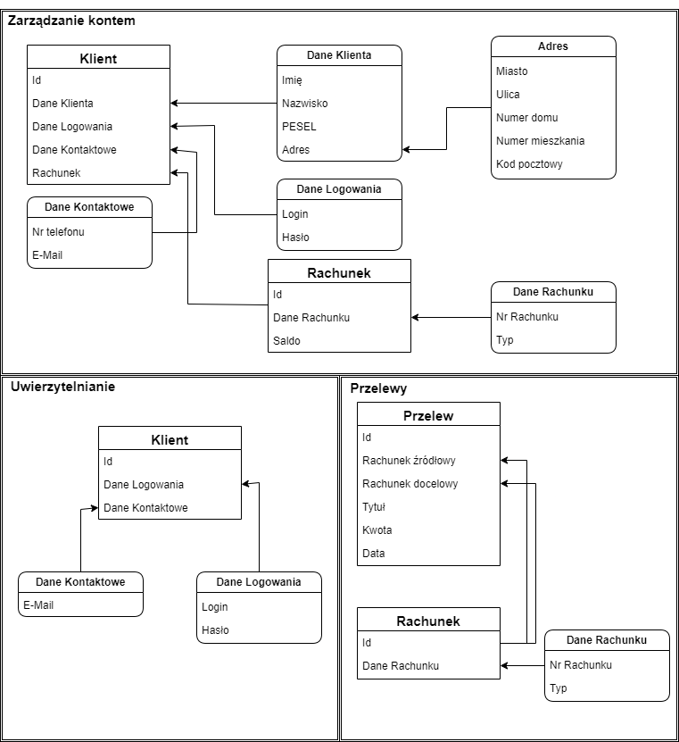

# Zadanie 1
## Opis zadania
W ramach pierwszego zadania należało przygotować model systemu bankowego ze zdefiniowanymi kontekstami, agregatami, encjami oraz value objects. Stworzony został model przedstawiony poniżej z trzema kontekstami **Uwierzytelnienie**, **Zarządzanie Kontem** oraz **Przelewy**. W ramach tych kontekstów stworzone ostały agregaty, gdzie korzeniem każdego z nich są encje **Klient** dla Uwierzytelnienia oraz Zarządzania Kontem oraz **Przelew** w kontekście Przelewy. 

## Schemat

## Założenia
|Encja/Value Object|Opis|
|---|---|
|**Klient**|Encja; W kontekście **Zarządzania Kontem** składa się z identyfikatora, wielu encji Rachunek oraz Value Objects: Dane Klienta, Dane Logowania, Dane Kontaktowe. W kontakście **Uwierzytelnianie** składa się z identyfikatora oraz Value Objects: Dane Logowania oraz Dane Kontaktowe|
|**Dane Klienta**|Value Object; Składa się z wartości Imię (String, ograniczenie do znaków alfabetycznych), Nazwisko (String, ograniczenie do znaków alfabetycznych), PESEL (String, ograniczenie do dokładnie 11 znaków numerycznych), oraz Value Object Adres|
|**Adres**|Value Object; Składa się z wartości Miasto (String, ograniczenie do znaków alfabetycznych), Ulica (String, ograniczenie do znaków alfabetycznych), Numer domu (Int), Numer mieszkania (Int), Kod pocztowy (String, ograniczony do znaków numerycznych oraz myślnika przez wyrażenie regularne)|
|**Dane logowania**|Value Object; Składa się z wartości Login (String, ograniczony do znaków alfanumerycznych) oraz Hasło (String, wartość hashowania dla bezpieczeństwa)|
|**Dane Kontaktowe**|Value Object; Składa się z wartości Nr telefonu (String, ograniczenie do znaków numerycznych i spacji, tylko w kontekście **Zarządzanie Kontem**) oraz E-Mail(String, ograniczenie przez wyrażenie regularne|
|**Rachunek**|Encja; W kontekście **Zarządzanie Kontem** składa się z identyfikatora, Value Object Dane Rachunku oraz Salda (Long Long Int); W kontekście **Przelewy** składa się z identyfikatora oraz Value Object Dane Rachunku|
|**Dane Rachunku**|Value Object; Składa się z wartości Nr rachunku (String, ograniczenie do znaków numerycznych) oraz Typ (Enum)|
|**Przelew**|Encja; Składa się z identyfikatora, encji Rachunek o nazwie Rachunek źródłowy oraz Rachunek docelowy, Tytułu (String, ograniczenenie do znaków alfanumerycznych), Kwoty (Long Long Int) oraz Daty (DateTime)|